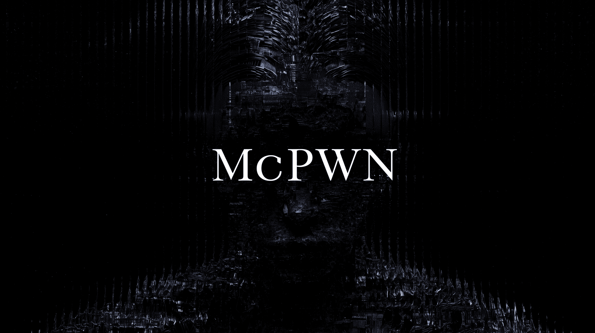

# mcpwn

**Static security scanner for MCP (Model Context Protocol) servers.**

<p align="center"></p>

mcpwn reads the tool definitions an MCP server advertises and flags the ones
that can turn an agent against its user.

Scanning never launches an MCP server and never calls a tool. `mcpwn audit`
does both, deliberately, and only under an engagement file that names the
target.

## Install

```bash
brew install mlab-sh/mcpwn/mcpwn
```

Or from source:

```bash
cargo install --locked --git https://github.com/mlab-sh/mcpwn
```

Prebuilt binaries for macOS and Linux, x86_64 and arm64, are attached to each
[release](https://github.com/mlab-sh/mcpwn/releases).

## Usage

Find the MCP configs on this machine, without analysing them:

```bash
mcpwn discover
```

See everything a server exposes, with no analysis:

```bash
mcpwn view --url https://example.com/mcp
```

Scan them:

```bash
mcpwn scan
```

Scan a project directory, or a single endpoint:

```bash
mcpwn scan ./my-repo
```

```bash
mcpwn scan --url https://example.com/mcp -H "Authorization: Bearer $TOKEN"
```

Record a baseline so later scans can tell you what changed:

```bash
mcpwn scan --write-lock
```

Understand a finding:

```bash
mcpwn explain MCPWN-CAP-001
```

Exit codes: `0` clean, `1` findings at or above the threshold, `2` error.

## What it detects

36 rules. `mcpwn explain` lists them all; `mcpwn explain <ID>` gives the detail.

| Family | Rules | What |
|---|---|---|
| Configuration | `MCPWN-CFG-001..004` | Plaintext credentials, unpinned launch packages, `http://` endpoints, credentials in URLs |
| Capability | `MCPWN-CAP-001..005` | Command execution, code evaluation, filesystem and network access, `x-mcp-header` mirroring |
| Obfuscation | `MCPWN-OBF-001..006` | Unicode tag characters, zero-width characters, bidi overrides, homoglyphs, encoded payloads |
| Rug pull | `MCPWN-RUG-001..003` | Tools that changed, disappeared or appeared since the lockfile |
| Shadowing | `MCPWN-SHA-001..003` | Colliding tool names, look-alike names, a server giving instructions about another server's tool |
| Toxic flow | `MCPWN-FLOW-001` | An ingest, a source and a sink coexisting in one environment |
| Reconnaissance | `MCPWN-NET-001..006` | Needs `--probe`: unenforced credentials, missing auth discovery, deprecated transport, plaintext downgrade, unvalidated protocol and headers |
| Confirmed defects | `MCPWN-ACT-001..008` | `mcpwn audit` only: path traversal, command injection, SQL injection, SSRF, session fixation, header injection, crash and error leaks under malformed input |

## Probing an endpoint

`--probe` asks a remote endpoint the questions enumeration does not: does it
need the credential it was given, how does it advertise authentication, what
else does it serve, and does it validate the protocol as the specification
requires.

```bash
mcpwn scan --url https://example.com/mcp --probe
```

```bash
mcpwn view --url https://example.com/mcp --probe
```

Read-only: no tool is ever called and nothing is written. It still sends extra
requests and touches paths you did not name, so it is off by default. Point it
only at servers you are entitled to examine.

## Rug pull detection

`mcp.lock` records what each tool looked like when you approved it. Later scans
compare against it.

```bash
mcpwn scan --write-lock     # record the baseline
mcpwn scan                  # compare against it
mcpwn scan --update-lock    # accept the changes, after reviewing them
mcpwn diff old.lock mcp.lock
```

## In CI

```bash
mcpwn scan --fail-on high --format sarif > mcpwn.sarif
```

`mcpwn init-policy > mcpwn.toml` creates a policy file for rule overrides and
accepted findings:

```toml
fail-on = "high"

[rules]
"MCPWN-CFG-002" = "off"

[[ignore]]
rule = "MCPWN-CAP-001"
scope = "shell::run_command"
reason = "reviewed 2026-08; this server exists to run commands"
```

The GitHub Action wraps all of it:

```yaml
- uses: mlab-sh/mcpwn@main
  with:
    policy: mcpwn.toml
    lock: mcp.lock
    fail-on: high
```

See [the action documentation](docs/github-action.md) for a complete workflow
and the full list of inputs.

## mcpwn audit

Active testing of a server you are entitled to act on. Every other command
reads; `audit` calls tools, which means it acts on the target.

```bash
mcpwn audit init > engagement.toml
mcpwn audit run --dry-run
mcpwn audit run
mcpwn audit run --format sarif --fail-on high > audit.sarif
```

The engagement file is the only way in. There is no `--url` and no config
discovery, so one command can never reach every server on a machine.

```toml
target = "https://mcp.example.com/mcp"
authorized_by = "you@example.com"
reference = "PT-2026-014"

[limits]
rate_per_second = 2
max_requests = 500

[tools]
allow = ["read_file", "fetch_url"]   # nothing else is called
allow_dangerous = false              # tools that take a command line
```

Seven probes. Four poison one parameter of one tool: path traversal, command
injection, SQL injection, SSRF to the cloud metadata service. Three test the
transport itself: session fixation, header injection, and malformed JSON-RPC.
`mcpwn audit probes` lists them; each looks for a specific oracle.

* Nothing destructive is sent. `; echo` yes, `; rm` never.
* Every hit is re-checked against a control call that must come back clean.
* Tools that take a command line are skipped unless `allow_dangerous` is set.
* `protocol-fuzz` is the only probe that can take a target down, so it runs only
  when an engagement names it. Nesting stops at 200 levels and payloads at 64 KiB.
* Header injection needs the request written by hand over a socket, so it covers
  `http://` targets only. An `https://` one is reported as not covered.
* Every request and response is written to a JSONL transcript as it happens.
* `--format`, `--policy` and `--fail-on` work exactly as they do for `scan`, so
  a rule accepted for a server is accepted whichever command found it. The JSON
  output carries the engagement and the transcript path alongside the findings.

A `stdio:` target launches the server, with no shell, a minimal environment, a
deadline and a kill on every exit path. `scan`, `view` and `discover` still
never launch anything and never call a tool.

## Supported clients

Claude Desktop, Cursor, Windsurf, Continue, Zed, Codex, VS Code. Global
locations are searched by default; a path argument searches project-level
dotfolders instead.

Only JSON configs are parsed. TOML (Codex) and YAML (Continue) files are
discovered and listed, but reported as not yet parseable.

## Limits

* stdio servers are never launched, so their tools are never listed. Only the
  configuration checks apply to them.
* Enumerating a remote server is a network request. The analysis is static; the
  tool list has to come from somewhere.
* Tool poisoning detection is not implemented yet.
* `mcpwn audit` never runs without an engagement file, and never calls a tool
  the engagement did not name.

## Documentation

* [How MCP works](docs/mcp.md), with sources
* [How the static checks work](docs/detection.md)
* [How the active audit works](docs/audit.md)
* [Using mcpwn in GitHub Actions](docs/github-action.md)

## Development

```bash
just test
```

```bash
just ci
```
